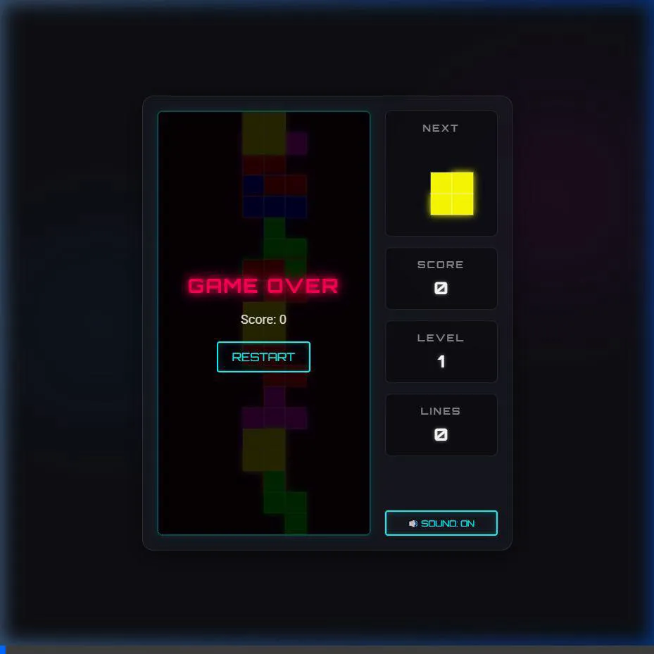

# 俄羅斯方塊實作成果總結

我們已經成功完成了純 HTML/CSS/JS 的俄羅斯方塊遊戲。以下是這次實作的主要成果與重點功能：

## 實作內容

- [index.html](./index.html)：建立遊戲的 DOM 結構與介面。
- [style.css](./style.css)：實作深色主題與現代化的「霓虹發光」風格。
- [audio.js](./audio.js)：實作一套基於 Web Audio API 的音效合成器，達成「零外部依賴」。
- [tetris.js](./tetris.js)：包含方塊形狀定義、核心迴圈、碰撞偵測、消除計分與防卡牆 (Wall Kick) 等核心邏輯。

## 遊玩影片示範

以下為遊戲實際遊玩的測試錄影過程：

## 測試與遊玩

> [!TIP]
> **開始遊玩**
> 您只需要直接用網頁瀏覽器開啟 [index.html](./index.html) 即可開始遊戲。進入畫面後按下 **空白鍵 (Space)** 啟動！

### 遊玩步驟：
1. 畫面會顯示起始頁，按下 **空白鍵 (Space)** 以啟動音效與遊戲迴圈。
2. 測試各種控制鍵：
   - `←` / `→`：左右移動
   - `↓`：軟下落
   - `Space`：硬下落 (直接落到底部)
   - `↑`：順時針旋轉
   - `Z`：逆時針旋轉
3. 您可以點擊右下角的 `🔊 Sound: ON` 按鈕來隨時開關音效。
